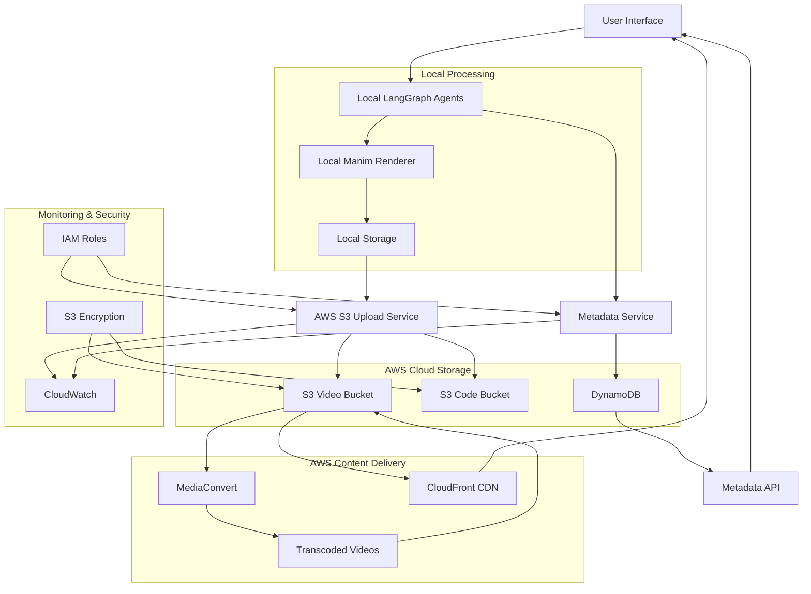

# Design Document

## Overview

This design document outlines the architecture for integrating AWS S3 storage capabilities with existing LangGraph agents for an AI-powered video editing system. The design maintains the existing local agent processing workflow while adding robust cloud storage, metadata management, and content delivery capabilities. The system follows a hybrid architecture where AI processing happens locally for performance and privacy, while AWS provides scalable storage and global content delivery.

## Architecture

### High-Level Architecture



### Component Architecture

#### Local Components

**LangGraph Agent Integration Layer**
- Extends existing RendererAgent and CodeGeneratorAgent with AWS capabilities
- Implements AWS SDK integration using boto3
- Provides fallback mechanisms for offline operation
- Handles authentication and error recovery

**AWS Upload Service**
- Manages multipart uploads for large video files
- Implements retry logic with exponential backoff
- Handles concurrent uploads with rate limiting
- Provides upload progress tracking and cancellation

**Local Metadata Cache**
- Caches DynamoDB metadata locally for offline access
- Implements conflict resolution for sync operations
- Provides fast local queries during agent processing
- Manages cache invalidation and cleanup

#### AWS Cloud Components

**S3 Storage Architecture**
- Video Bucket: Organized by project_id/video_id/chunk_id structure
- Code Bucket: Versioned storage for Manim code files
- Lifecycle policies for automatic cost optimization
- Cross-region replication for disaster recovery

**DynamoDB Metadata Store**
- Primary table: VideoMetadata with video_id as partition key
- Global Secondary Index: ProjectIndex for project-based queries
- Local Secondary Index: VersionIndex for version history
- Point-in-time recovery enabled

**CloudFront Distribution**
- Origin: S3 Video Bucket with OAI (Origin Access Identity)
- Caching behaviors optimized for video content
- Custom error pages for better user experience
- Geographic restrictions and security headers

## Components and Interfaces

### AWS Integration Service

```python
import boto3
import asyncio
import logging
from botocore.exceptions import ClientError
from boto3.s3.transfer import TransferConfig
from typing import List, Dict, Optional, Any

class AWSIntegrationService:
    """Central service for all AWS operations using Boto3 SDK"""
    
    def __init__(self, config: AWSConfig):
        # Initialize Boto3 clients with proper configuration
        self.s3_client = boto3.client('s3', region_name=config.region)
        self.s3_resource = boto3.resource('s3', region_name=config.region)
        self.dynamodb = boto3.resource('dynamodb', region_name=config.region)
        self.mediaconvert = boto3.client('mediaconvert', region_name=config.region)
        self.config = config
        
        # Configure multipart upload settings based on Context7 best practices
        self.transfer_config = TransferConfig(
            multipart_threshold=config.multipart_threshold,
            max_concurrency=config.max_concurrent_uploads,
            multipart_chunksize=8 * 1024 * 1024,  # 8MB chunks
            use_threads=True
        )
        
        # Initialize DynamoDB table reference
        self.metadata_table = self.dynamodb.Table(config.metadata_table_name)
        
        logger.info(f"AWS Integration Service initialized for region: {config.region}")
    
    async def upload_video_chunks(self, chunks: List[VideoChunk]) -> List[str]:
        """Upload video chunks to S3 with multipart support and progress tracking"""
        upload_results = []
        
        for chunk in chunks:
            try:
                # Use upload_file with TransferConfig for large files
                s3_key = f"videos/{chunk.project_id}/{chunk.video_id}/chunk_{chunk.scene_number:03d}_v{chunk.version}.mp4"
                
                # Create progress callback based on Context7 examples
                progress_callback = ProgressPercentage(chunk.file_path)
                
                # Upload with metadata and encryption
                extra_args = {
                    'Metadata': {
                        'video_id': chunk.video_id,
                        'scene_number': str(chunk.scene_number),
                        'version': str(chunk.version),
                        'project_id': chunk.project_id
                    }
                }
                
                # Add encryption if configured
                if self.config.enable_encryption:
                    if self.config.kms_key_id:
                        extra_args.update({
                            'ServerSideEncryption': 'aws:kms',
                            'SSEKMSKeyId': self.config.kms_key_id
                        })
                    else:
                        extra_args['ServerSideEncryption'] = 'AES256'
                
                # Perform upload with retry logic
                await self._upload_with_retry(
                    file_path=chunk.file_path,
                    bucket=self.config.video_bucket_name,
                    key=s3_key,
                    extra_args=extra_args,
                    callback=progress_callback
                )
                
                upload_results.append(f"s3://{self.config.video_bucket_name}/{s3_key}")
                logger.info(f"Successfully uploaded chunk: {s3_key}")
                
            except Exception as e:
                logger.error(f"Failed to upload chunk {chunk.file_path}: {e}")
                upload_results.append(None)
        
        return upload_results
    
    async def upload_code(self, code: str, metadata: CodeMetadata) -> str:
        """Upload Manim code to S3 with versioning"""
        try:
            s3_key = f"code/{metadata.project_id}/{metadata.video_id}/{metadata.video_id}_v{metadata.version}.py"
            
            # Upload code as string content
            self.s3_client.put_object(
                Bucket=self.config.code_bucket_name,
                Key=s3_key,
                Body=code.encode('utf-8'),
                ContentType='text/x-python',
                Metadata={
                    'video_id': metadata.video_id,
                    'version': str(metadata.version),
                    'project_id': metadata.project_id,
                    'generated_at': metadata.created_at.isoformat()
                },
                ServerSideEncryption='AES256' if self.config.enable_encryption else None
            )
            
            s3_path = f"s3://{self.config.code_bucket_name}/{s3_key}"
            logger.info(f"Successfully uploaded code: {s3_path}")
            return s3_path
            
        except ClientError as e:
            logger.error(f"Failed to upload code: {e}")
            raise
    
    async def update_metadata(self, video_id: str, metadata: dict) -> bool:
        """Update video metadata in DynamoDB with batch operations"""
        try:
            # Use DynamoDB update_item with proper expression syntax
            update_expression_parts = []
            expression_attribute_values = {}
            
            for key, value in metadata.items():
                if key != 'video_id':  # Don't update the primary key
                    update_expression_parts.append(f"{key} = :{key}")
                    expression_attribute_values[f":{key}"] = value
            
            if not update_expression_parts:
                return True
            
            update_expression = "SET " + ", ".join(update_expression_parts)
            
            self.metadata_table.update_item(
                Key={'video_id': video_id},
                UpdateExpression=update_expression,
                ExpressionAttributeValues=expression_attribute_values
            )
            
            logger.info(f"Successfully updated metadata for video: {video_id}")
            return True
            
        except ClientError as e:
            logger.error(f"Failed to update metadata for {video_id}: {e}")
            return False
    
    async def download_code(self, video_id: str, version: str) -> str:
        """Download Manim code from S3"""
        try:
            # First get metadata to find the correct S3 path
            response = self.metadata_table.get_item(
                Key={'video_id': video_id}
            )
            
            if 'Item' not in response:
                raise ValueError(f"Video {video_id} not found in metadata")
            
            item = response['Item']
            project_id = item['project_id']
            
            # Construct S3 key
            s3_key = f"code/{project_id}/{video_id}/{video_id}_v{version}.py"
            
            # Download code content
            response = self.s3_client.get_object(
                Bucket=self.config.code_bucket_name,
                Key=s3_key
            )
            
            code_content = response['Body'].read().decode('utf-8')
            logger.info(f"Successfully downloaded code: {s3_key}")
            return code_content
            
        except ClientError as e:
            logger.error(f"Failed to download code for {video_id} v{version}: {e}")
            raise
    
    async def trigger_transcoding(self, video_path: str) -> str:
        """Trigger AWS MediaConvert job for video transcoding"""
        try:
            # MediaConvert job configuration for adaptive bitrate streaming
            job_settings = {
                "Role": self.config.mediaconvert_role_arn,
                "Settings": {
                    "Inputs": [{
                        "FileInput": video_path,
                        "AudioSelectors": {
                            "Audio Selector 1": {
                                "DefaultSelection": "DEFAULT"
                            }
                        }
                    }],
                    "OutputGroups": [
                        {
                            "Name": "HLS",
                            "OutputGroupSettings": {
                                "Type": "HLS_GROUP_SETTINGS",
                                "HlsGroupSettings": {
                                    "Destination": f"s3://{self.config.video_bucket_name}/transcoded/",
                                    "SegmentLength": 10,
                                    "MinSegmentLength": 0
                                }
                            },
                            "Outputs": [
                                {
                                    "NameModifier": "_1080p",
                                    "VideoDescription": {
                                        "Width": 1920,
                                        "Height": 1080,
                                        "CodecSettings": {
                                            "Codec": "H_264",
                                            "H264Settings": {
                                                "Bitrate": 5000000,
                                                "RateControlMode": "CBR"
                                            }
                                        }
                                    }
                                },
                                {
                                    "NameModifier": "_720p",
                                    "VideoDescription": {
                                        "Width": 1280,
                                        "Height": 720,
                                        "CodecSettings": {
                                            "Codec": "H_264",
                                            "H264Settings": {
                                                "Bitrate": 3000000,
                                                "RateControlMode": "CBR"
                                            }
                                        }
                                    }
                                }
                            ]
                        }
                    ]
                }
            }
            
            response = self.mediaconvert.create_job(**job_settings)
            job_id = response['Job']['Id']
            
            logger.info(f"Started MediaConvert job: {job_id}")
            return job_id
            
        except ClientError as e:
            logger.error(f"Failed to trigger transcoding: {e}")
            raise
    
    async def _upload_with_retry(self, file_path: str, bucket: str, key: str, 
                                extra_args: dict, callback=None, max_retries: int = 3):
        """Upload file with retry logic and exponential backoff"""
        for attempt in range(max_retries):
            try:
                self.s3_client.upload_file(
                    file_path, bucket, key,
                    ExtraArgs=extra_args,
                    Config=self.transfer_config,
                    Callback=callback
                )
                return
                
            except ClientError as e:
                if attempt == max_retries - 1:
                    raise
                
                # Calculate exponential backoff delay
                delay = (2 ** attempt) + (random.random() * 0.1)
                logger.warning(f"Upload attempt {attempt + 1} failed, retrying in {delay:.2f}s: {e}")
                await asyncio.sleep(delay)


class ProgressPercentage:
    """Progress callback class based on Context7 Boto3 examples"""
    
    def __init__(self, filename):
        self._filename = filename
        self._size = float(os.path.getsize(filename))
        self._seen_so_far = 0
        self._lock = threading.Lock()
    
    def __call__(self, bytes_amount):
        with self._lock:
            self._seen_so_far += bytes_amount
            percentage = (self._seen_so_far / self._size) * 100
            sys.stdout.write(
                f"\r{self._filename}  {self._seen_so_far} / {self._size}  ({percentage:.2f}%)"
            )
            sys.stdout.flush()
```

### Enhanced Agent Classes

**RendererAgent Extensions**
```python
import boto3
from botocore.exceptions import ClientError
from boto3.s3.transfer import TransferConfig

class RendererAgent(BaseAgent):
    def __init__(self, config, system_config, aws_service: AWSIntegrationService):
        super().__init__(config, system_config)
        self.aws_service = aws_service
        self.upload_queue = asyncio.Queue()
        
        # Initialize S3 transfer configuration for large video files
        self.transfer_config = TransferConfig(
            multipart_threshold=100 * 1024 * 1024,  # 100MB
            max_concurrency=3,
            multipart_chunksize=8 * 1024 * 1024,   # 8MB chunks
            use_threads=True
        )
    
    async def execute(self, state: VideoGenerationState) -> Command:
        # Existing rendering logic
        rendered_videos = await self.render_videos(state)
        
        # New AWS integration with proper error handling
        if self.config.enable_aws_upload:
            try:
                upload_results = await self.upload_to_aws(rendered_videos, state)
                state.update({
                    "aws_upload_results": upload_results,
                    "upload_status": "completed"
                })
                
                # Update DynamoDB metadata
                await self._update_video_metadata(state, upload_results)
                
            except Exception as e:
                logger.error(f"AWS upload failed: {e}")
                state.update({
                    "upload_status": "failed",
                    "upload_error": str(e)
                })
                
                # Continue workflow even if upload fails (graceful degradation)
                if not self.config.require_aws_upload:
                    logger.warning("Continuing workflow without AWS upload")
        
        return self.route_to_next_agent(state)
    
    async def upload_to_aws(self, videos: dict, state: VideoGenerationState) -> dict:
        """Upload rendered videos to S3 with progress tracking"""
        upload_results = {}
        video_chunks = []
        
        # Prepare video chunks for batch upload
        for scene_number, video_path in videos.items():
            chunk = VideoChunk(
                file_path=video_path,
                project_id=state.get('project_id', 'default'),
                video_id=state['video_id'],
                scene_number=scene_number,
                version=state.get('version', 1)
            )
            video_chunks.append(chunk)
        
        # Upload chunks using AWS service
        s3_paths = await self.aws_service.upload_video_chunks(video_chunks)
        
        # Map results back to scene numbers
        for i, (scene_number, _) in enumerate(videos.items()):
            upload_results[scene_number] = s3_paths[i]
        
        # Upload combined video if available
        if state.get('combined_video_path'):
            combined_chunk = VideoChunk(
                file_path=state['combined_video_path'],
                project_id=state.get('project_id', 'default'),
                video_id=state['video_id'],
                scene_number=0,  # Use 0 for combined video
                version=state.get('version', 1)
            )
            
            combined_s3_paths = await self.aws_service.upload_video_chunks([combined_chunk])
            upload_results['combined'] = combined_s3_paths[0]
        
        return upload_results
    
    async def _update_video_metadata(self, state: VideoGenerationState, upload_results: dict):
        """Update DynamoDB with video upload results"""
        metadata_update = {
            'status': 'uploaded',
            'chunk_s3_paths': [path for path in upload_results.values() if path],
            'last_edited_timestamp': datetime.utcnow().isoformat(),
            'upload_completed_at': datetime.utcnow().isoformat()
        }
        
        if 'combined' in upload_results:
            metadata_update['s3_path_full_video'] = upload_results['combined']
        
        await self.aws_service.update_metadata(state['video_id'], metadata_update)
    
    async def handle_upload_failure(self, error: Exception, retry_count: int) -> bool:
        """Handle upload failures with exponential backoff"""
        if isinstance(error, ClientError):
            error_code = error.response['Error']['Code']
            
            # Handle specific AWS errors
            if error_code == 'NoSuchBucket':
                logger.error("S3 bucket does not exist")
                return False
            elif error_code == 'AccessDenied':
                logger.error("Access denied to S3 bucket")
                return False
            elif error_code in ['RequestTimeout', 'ServiceUnavailable']:
                # Retry for temporary errors
                if retry_count < 3:
                    delay = (2 ** retry_count) + random.random()
                    await asyncio.sleep(delay)
                    return True
        
        return False
```

**CodeGeneratorAgent Extensions**
```python
import boto3
from botocore.exceptions import ClientError

class CodeGeneratorAgent(BaseAgent):
    def __init__(self, config, system_config, aws_service: AWSIntegrationService):
        super().__init__(config, system_config)
        self.aws_service = aws_service
    
    async def execute(self, state: VideoGenerationState) -> Command:
        # Check if we need to download existing code for editing
        if state.get('editing_existing_video'):
            try:
                existing_code = await self.download_existing_code(state)
                state.update({"existing_code": existing_code})
                logger.info(f"Downloaded existing code for video: {state['video_id']}")
            except Exception as e:
                logger.error(f"Failed to download existing code: {e}")
                # Continue without existing code if download fails
                state.update({"existing_code": None})
        
        # Existing code generation logic
        generated_code = await self.generate_code(state)
        
        # Upload new code to AWS with proper versioning
        if self.config.enable_aws_upload and generated_code:
            try:
                code_upload_result = await self.upload_code_to_aws(generated_code, state)
                state.update({
                    "code_upload_result": code_upload_result,
                    "code_upload_status": "completed"
                })
                
                # Update DynamoDB metadata with code paths
                await self._update_code_metadata(state, code_upload_result)
                
            except Exception as e:
                logger.error(f"Code upload failed: {e}")
                state.update({
                    "code_upload_status": "failed",
                    "code_upload_error": str(e)
                })
        
        return self.route_to_next_agent(state)
    
    async def download_existing_code(self, state: VideoGenerationState) -> dict:
        """Download existing Manim code from S3 for editing"""
        video_id = state['video_id']
        current_version = state.get('current_version', '1')
        
        try:
            # Download the current version of the code
            code_content = await self.aws_service.download_code(video_id, current_version)
            
            # Parse code into scenes (simplified - would need proper parsing)
            # For now, return as single block
            return {"main": code_content}
            
        except ClientError as e:
            if e.response['Error']['Code'] == 'NoSuchKey':
                logger.warning(f"No existing code found for video {video_id} version {current_version}")
                return {}
            else:
                raise
    
    async def upload_code_to_aws(self, code: dict, state: VideoGenerationState) -> dict:
        """Upload generated Manim code to S3 with versioning"""
        upload_results = {}
        
        # Determine new version number
        new_version = state.get('version', 1)
        if state.get('editing_existing_video'):
            new_version = state.get('current_version', 1) + 1
        
        # Upload each scene's code
        for scene_number, scene_code in code.items():
            try:
                # Create metadata for this code upload
                code_metadata = CodeMetadata(
                    video_id=state['video_id'],
                    project_id=state.get('project_id', 'default'),
                    version=new_version,
                    scene_number=scene_number,
                    created_at=datetime.utcnow()
                )
                
                # Upload to S3
                s3_path = await self.aws_service.upload_code(scene_code, code_metadata)
                upload_results[scene_number] = s3_path
                
                logger.info(f"Uploaded code for scene {scene_number}: {s3_path}")
                
            except Exception as e:
                logger.error(f"Failed to upload code for scene {scene_number}: {e}")
                upload_results[scene_number] = None
        
        return upload_results
    
    async def _update_code_metadata(self, state: VideoGenerationState, upload_results: dict):
        """Update DynamoDB with code upload results"""
        # Filter out failed uploads
        successful_uploads = {k: v for k, v in upload_results.items() if v is not None}
        
        if not successful_uploads:
            logger.warning("No successful code uploads to record in metadata")
            return
        
        # Update metadata with new version and code paths
        new_version = state.get('version', 1)
        if state.get('editing_existing_video'):
            new_version = state.get('current_version', 1) + 1
        
        metadata_update = {
            'current_version_id': f"v{new_version}",
            'code_s3_paths': successful_uploads,
            'last_edited_timestamp': datetime.utcnow().isoformat(),
            'code_upload_completed_at': datetime.utcnow().isoformat(),
            'status': 'code_ready'
        }
        
        # Set main code path (use first successful upload or combined code)
        if 'main' in successful_uploads:
            metadata_update['s3_path_code'] = successful_uploads['main']
        elif successful_uploads:
            metadata_update['s3_path_code'] = list(successful_uploads.values())[0]
        
        await self.aws_service.update_metadata(state['video_id'], metadata_update)
        
        # Update state with new version
        state.update({
            'current_version': new_version,
            'version': new_version
        })
```

### Metadata Management

**DynamoDB Schema**
```json
{
  "TableName": "VideoMetadata",
  "KeySchema": [
    {"AttributeName": "video_id", "KeyType": "HASH"}
  ],
  "AttributeDefinitions": [
    {"AttributeName": "video_id", "AttributeType": "S"},
    {"AttributeName": "project_id", "AttributeType": "S"},
    {"AttributeName": "version_id", "AttributeType": "S"},
    {"AttributeName": "created_timestamp", "AttributeType": "N"}
  ],
  "GlobalSecondaryIndexes": [
    {
      "IndexName": "ProjectIndex",
      "KeySchema": [
        {"AttributeName": "project_id", "KeyType": "HASH"},
        {"AttributeName": "created_timestamp", "KeyType": "RANGE"}
      ]
    }
  ]
}
```

**Metadata Service Interface**
```python
class MetadataService:
    """Service for managing video and code metadata"""
    
    async def create_video_record(self, video_id: str, project_data: dict) -> bool
    async def update_video_status(self, video_id: str, status: str) -> bool
    async def add_s3_paths(self, video_id: str, paths: dict) -> bool
    async def get_video_metadata(self, video_id: str) -> dict
    async def list_project_videos(self, project_id: str) -> List[dict]
    async def get_code_history(self, video_id: str) -> List[dict]
```

### Upload Management

**Multipart Upload Handler**
```python
import boto3
import hashlib
import os
from botocore.exceptions import ClientError
from boto3.s3.transfer import TransferConfig

class MultipartUploadHandler:
    """Handles large file uploads with resume capability using Boto3"""
    
    def __init__(self, s3_client, bucket_name: str):
        self.s3_client = s3_client
        self.bucket_name = bucket_name
        self.chunk_size = 100 * 1024 * 1024  # 100MB chunks
        
        # Configure transfer settings based on Context7 best practices
        self.transfer_config = TransferConfig(
            multipart_threshold=self.chunk_size,
            max_concurrency=3,
            multipart_chunksize=8 * 1024 * 1024,  # 8MB per part
            use_threads=True
        )
    
    async def upload_large_file(self, file_path: str, s3_key: str, 
                               extra_args: dict = None, callback=None) -> str:
        """Upload large file using Boto3's managed transfer with multipart support"""
        try:
            # Use Boto3's high-level upload_file which automatically handles multipart
            self.s3_client.upload_file(
                file_path,
                self.bucket_name,
                s3_key,
                ExtraArgs=extra_args or {},
                Config=self.transfer_config,
                Callback=callback
            )
            
            s3_url = f"s3://{self.bucket_name}/{s3_key}"
            logger.info(f"Successfully uploaded large file: {s3_url}")
            return s3_url
            
        except ClientError as e:
            logger.error(f"Failed to upload large file {file_path}: {e}")
            raise
    
    async def resume_upload(self, upload_id: str, file_path: str, s3_key: str) -> str:
        """Resume a multipart upload using existing upload ID"""
        try:
            # List existing parts
            response = self.s3_client.list_parts(
                Bucket=self.bucket_name,
                Key=s3_key,
                UploadId=upload_id
            )
            
            existing_parts = response.get('Parts', [])
            uploaded_part_numbers = {part['PartNumber'] for part in existing_parts}
            
            # Calculate file size and total parts needed
            file_size = os.path.getsize(file_path)
            total_parts = (file_size + self.chunk_size - 1) // self.chunk_size
            
            parts = []
            
            # Upload missing parts
            with open(file_path, 'rb') as f:
                for part_number in range(1, total_parts + 1):
                    if part_number in uploaded_part_numbers:
                        # Part already uploaded, add to parts list
                        existing_part = next(p for p in existing_parts if p['PartNumber'] == part_number)
                        parts.append({
                            'ETag': existing_part['ETag'],
                            'PartNumber': part_number
                        })
                        continue
                    
                    # Upload missing part
                    f.seek((part_number - 1) * self.chunk_size)
                    chunk_data = f.read(self.chunk_size)
                    
                    response = self.s3_client.upload_part(
                        Bucket=self.bucket_name,
                        Key=s3_key,
                        PartNumber=part_number,
                        UploadId=upload_id,
                        Body=chunk_data
                    )
                    
                    parts.append({
                        'ETag': response['ETag'],
                        'PartNumber': part_number
                    })
            
            # Complete multipart upload
            self.s3_client.complete_multipart_upload(
                Bucket=self.bucket_name,
                Key=s3_key,
                UploadId=upload_id,
                MultipartUpload={'Parts': parts}
            )
            
            s3_url = f"s3://{self.bucket_name}/{s3_key}"
            logger.info(f"Successfully resumed and completed upload: {s3_url}")
            return s3_url
            
        except ClientError as e:
            logger.error(f"Failed to resume upload {upload_id}: {e}")
            # Abort the upload on failure
            await self.abort_upload(upload_id, s3_key)
            raise
    
    async def abort_upload(self, upload_id: str, s3_key: str) -> bool:
        """Abort a multipart upload to clean up resources"""
        try:
            self.s3_client.abort_multipart_upload(
                Bucket=self.bucket_name,
                Key=s3_key,
                UploadId=upload_id
            )
            
            logger.info(f"Successfully aborted upload: {upload_id}")
            return True
            
        except ClientError as e:
            logger.error(f"Failed to abort upload {upload_id}: {e}")
            return False
    
    def calculate_progress(self, uploaded_parts: int, total_parts: int) -> float:
        """Calculate upload progress percentage"""
        if total_parts == 0:
            return 0.0
        return (uploaded_parts / total_parts) * 100.0
    
    async def verify_upload_integrity(self, file_path: str, s3_key: str) -> bool:
        """Verify uploaded file integrity using ETag comparison"""
        try:
            # Get S3 object metadata
            response = self.s3_client.head_object(
                Bucket=self.bucket_name,
                Key=s3_key
            )
            
            s3_etag = response['ETag'].strip('"')
            file_size = response['ContentLength']
            
            # Calculate local file hash
            local_file_size = os.path.getsize(file_path)
            
            # Basic size check
            if local_file_size != file_size:
                logger.error(f"File size mismatch: local={local_file_size}, s3={file_size}")
                return False
            
            # For multipart uploads, ETag is not a simple MD5
            # For single part uploads, we can verify MD5
            if '-' not in s3_etag:  # Single part upload
                with open(file_path, 'rb') as f:
                    local_md5 = hashlib.md5(f.read()).hexdigest()
                
                if local_md5 != s3_etag:
                    logger.error(f"MD5 mismatch: local={local_md5}, s3={s3_etag}")
                    return False
            
            logger.info(f"Upload integrity verified for: {s3_key}")
            return True
            
        except ClientError as e:
            logger.error(f"Failed to verify upload integrity: {e}")
            return False
```

## Data Models

### Video Metadata Model

```python
@dataclass
class VideoMetadata:
    video_id: str
    project_id: str
    current_version_id: str
    title: str
    description: str
    tags: List[str]
    
    # S3 Paths
    s3_path_full_video: str
    s3_path_code: str
    chunk_s3_paths: List[str]
    transcoded_paths: dict  # quality -> s3_path mapping
    
    # Timestamps
    creation_timestamp: datetime
    last_edited_timestamp: datetime
    
    # Status and Processing
    status: VideoStatus  # rendering, uploading, ready, error
    processing_stats: dict
    
    # CloudFront
    cloudfront_url: str
    cache_invalidation_id: Optional[str]
```

### Upload Task Model

```python
@dataclass
class UploadTask:
    task_id: str
    file_path: str
    s3_bucket: str
    s3_key: str
    file_size: int
    
    # Progress tracking
    bytes_uploaded: int
    upload_id: Optional[str]  # For multipart uploads
    parts_uploaded: List[int]
    
    # Status
    status: UploadStatus  # pending, in_progress, completed, failed
    error_message: Optional[str]
    retry_count: int
    
    # Metadata
    created_at: datetime
    started_at: Optional[datetime]
    completed_at: Optional[datetime]
```

### AWS Configuration Model

```python
@dataclass
class AWSConfig:
    # S3 Configuration
    video_bucket_name: str
    code_bucket_name: str
    region: str
    
    # Upload Settings
    enable_multipart_upload: bool = True
    multipart_threshold: int = 100 * 1024 * 1024  # 100MB
    max_concurrent_uploads: int = 3
    retry_attempts: int = 3
    
    # DynamoDB
    metadata_table_name: str
    
    # CloudFront
    distribution_id: str
    cloudfront_domain: str
    
    # MediaConvert
    mediaconvert_endpoint: str
    mediaconvert_role_arn: str
    
    # Security
    kms_key_id: Optional[str]
    enable_encryption: bool = True
```

## Error Handling

### Error Classification and Recovery Strategies

**Network Errors**
- Temporary connectivity issues: Exponential backoff retry
- DNS resolution failures: Switch to alternative endpoints
- Timeout errors: Increase timeout and retry with smaller chunks

**AWS Service Errors**
- Rate limiting (429): Implement jitter and exponential backoff
- Service unavailable (503): Queue operations for later retry
- Access denied (403): Log error and notify administrator
- Resource not found (404): Verify configuration and create if needed

**File System Errors**
- Disk space full: Clean up temporary files and retry
- Permission denied: Log error and request manual intervention
- File corruption: Verify checksums and re-generate if needed

### Error Recovery Workflow

```python
class ErrorRecoveryService:
    """Handles error recovery for AWS operations"""
    
    async def handle_upload_error(self, error: Exception, task: UploadTask) -> RecoveryAction
    async def handle_metadata_error(self, error: Exception, operation: str) -> RecoveryAction
    async def handle_download_error(self, error: Exception, s3_key: str) -> RecoveryAction
    
    def should_retry(self, error: Exception, retry_count: int) -> bool
    def calculate_backoff_delay(self, retry_count: int) -> float
    async def notify_administrators(self, error: Exception, context: dict) -> None
```

## Testing Strategy

### Unit Testing

**AWS Service Mocking**
- Use moto library for S3, DynamoDB, and MediaConvert mocking
- Test all error conditions and edge cases
- Verify retry logic and backoff calculations
- Test multipart upload resume functionality

**Agent Integration Testing**
- Mock AWS services to test agent behavior
- Test offline mode and sync functionality
- Verify error handling and recovery
- Test concurrent upload scenarios

### Integration Testing

**End-to-End Workflows**
- Test complete video creation and upload workflow
- Test video editing and re-upload workflow
- Test metadata consistency across services
- Test CloudFront cache invalidation

**Performance Testing**
- Test large file upload performance
- Test concurrent upload limits
- Test metadata query performance
- Test CloudFront cache hit rates

### Load Testing

**Upload Scalability**
- Test multiple concurrent video uploads
- Test system behavior under high load
- Test AWS service limit handling
- Test cost optimization under load

**Monitoring and Alerting**
- Test CloudWatch metric collection
- Test error notification systems
- Test cost monitoring and alerts
- Test performance degradation detection

## Security Considerations

### Authentication and Authorization

**IAM Role Configuration**
```json
{
  "Version": "2012-10-17",
  "Statement": [
    {
      "Effect": "Allow",
      "Action": [
        "s3:PutObject",
        "s3:GetObject",
        "s3:DeleteObject"
      ],
      "Resource": [
        "arn:aws:s3:::video-bucket/*",
        "arn:aws:s3:::code-bucket/*"
      ]
    },
    {
      "Effect": "Allow",
      "Action": [
        "dynamodb:PutItem",
        "dynamodb:GetItem",
        "dynamodb:UpdateItem",
        "dynamodb:Query"
      ],
      "Resource": "arn:aws:dynamodb:region:account:table/VideoMetadata"
    }
  ]
}
```

**Encryption Strategy**
- S3: Server-side encryption with KMS keys
- DynamoDB: Encryption at rest enabled
- In-transit: TLS 1.2+ for all communications
- Local storage: Optional encryption for sensitive code

### Access Control

**S3 Bucket Policies**
- Deny public access by default
- Allow access only through CloudFront OAI
- Implement IP-based restrictions if needed
- Enable access logging for audit trails

**DynamoDB Security**
- Enable point-in-time recovery
- Use VPC endpoints for private access
- Implement fine-grained access control
- Enable CloudTrail logging

## Performance Optimization

### Upload Optimization

**Multipart Upload Strategy**
- Use 100MB chunks for optimal performance
- Implement parallel part uploads
- Resume failed uploads automatically
- Verify upload integrity with checksums

**Bandwidth Management**
- Implement upload rate limiting
- Prioritize critical uploads
- Use compression for code files
- Monitor and adjust based on network conditions

### Caching Strategy

**Local Caching**
- Cache frequently accessed metadata
- Cache recently downloaded code
- Implement LRU eviction policy
- Sync cache with cloud periodically

**CloudFront Optimization**
- Set appropriate TTL values for video content
- Use origin request policies for dynamic content
- Implement custom error pages
- Monitor cache hit rates and optimize

### Cost Optimization

**S3 Storage Classes**
- Use S3 Standard for active videos
- Transition to IA after 30 days
- Archive to Glacier after 90 days
- Delete temporary files automatically

**Data Transfer Optimization**
- Use CloudFront for global delivery
- Implement regional S3 buckets if needed
- Compress data where possible
- Monitor and optimize transfer patterns