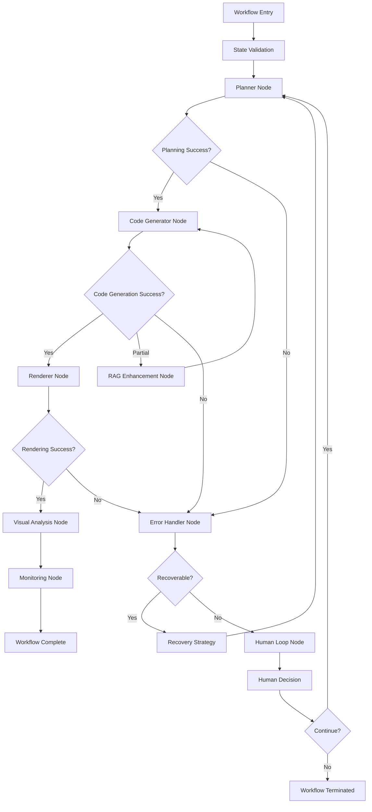

# Design Document

## Overview

This design outlines the refactoring of the existing video generation agent system to follow LangGraph best practices. The current system has complex class hierarchies, mixed responsibilities, and inconsistent error handling patterns. The refactor will transform the system into a clean, maintainable architecture using simple node functions, proper state management, and robust error handling while preserving all existing functionality.

The refactored system will maintain backward compatibility with existing APIs while internally restructuring to follow LangGraph patterns. This approach ensures existing integrations continue to work while providing a foundation for future enhancements.

## Architecture

### Current Architecture Issues

The current system has several architectural problems:
- Complex inheritance hierarchies with BaseAgent containing too many responsibilities
- Mixed synchronous and asynchronous patterns causing confusion
- Inconsistent error handling across different agents
- State management scattered across multiple classes
- Heavy coupling between agents and their internal implementations
- Performance optimization code mixed with business logic

### New Architecture Principles

The refactored architecture will follow these principles:

1. **Simple Node Functions**: Each agent becomes a simple, focused function that takes state and returns updated state
2. **Centralized State Management**: All workflow state managed through a single Pydantic model
3. **Conditional Routing**: Use LangGraph's conditional edges for dynamic workflow routing
4. **Separation of Concerns**: Business logic, error handling, and performance optimization clearly separated
5. **Dependency Injection**: External dependencies injected rather than created within agents

### High-Level Architecture



## Components and Interfaces

### Core State Model

```python
class VideoGenerationState(BaseModel):
    # Core workflow data
    topic: str
    description: str
    session_id: str
    
    # Configuration
    config: WorkflowConfig
    
    # Planning state
    scene_outline: Optional[str] = None
    scene_implementations: Dict[int, str] = {}
    detected_plugins: List[str] = []
    
    # Code generation state
    generated_code: Dict[int, str] = {}
    code_errors: Dict[int, str] = {}
    
    # Rendering state
    rendered_videos: Dict[int, str] = {}
    combined_video_path: Optional[str] = None
    
    # Error handling
    errors: List[WorkflowError] = []
    retry_counts: Dict[str, int] = {}
    
    # Performance metrics
    metrics: Dict[str, Any] = {}
    
    # Workflow control
    current_step: str = "planning"
    workflow_complete: bool = False
```

### Node Function Interface

All agent nodes will follow this simple interface:

```python
async def agent_node(state: VideoGenerationState) -> VideoGenerationState:
    """
    Simple node function that:
    1. Validates input state
    2. Performs specific operation
    3. Updates state with results
    4. Returns updated state
    """
    pass
```

### Service Layer

Business logic will be extracted into service classes:

```python
class PlanningService:
    def __init__(self, config: PlanningConfig):
        self.config = config
    
    async def generate_scene_outline(self, topic: str, description: str) -> str:
        # Pure business logic without state management
        pass

class CodeGenerationService:
    def __init__(self, config: CodeGenerationConfig):
        self.config = config
    
    async def generate_scene_code(self, implementation: str, context: str) -> str:
        # Pure business logic without state management
        pass
```

### Error Handling System

```python
class ErrorHandler:
    def __init__(self, recovery_strategies: Dict[str, RecoveryStrategy]):
        self.strategies = recovery_strategies
    
    async def handle_error(self, error: WorkflowError, state: VideoGenerationState) -> RecoveryAction:
        # Centralized error handling logic
        pass

class RecoveryStrategy:
    def can_recover(self, error: WorkflowError) -> bool:
        pass
    
    async def execute_recovery(self, state: VideoGenerationState) -> VideoGenerationState:
        pass
```

## Data Models

### State Models

```python
class WorkflowConfig(BaseModel):
    # Model configurations
    planner_model: str = "openrouter/anthropic/claude-3.5-sonnet"
    code_model: str = "openrouter/anthropic/claude-3.5-sonnet"
    
    # Feature flags
    use_rag: bool = True
    use_visual_analysis: bool = False
    enable_caching: bool = True
    
    # Performance settings
    max_retries: int = 3
    timeout_seconds: int = 300
    max_concurrent_scenes: int = 5

class WorkflowError(BaseModel):
    step: str
    error_type: str
    message: str
    timestamp: datetime
    retry_count: int = 0
    recoverable: bool = True
    context: Dict[str, Any] = {}

class PerformanceMetrics(BaseModel):
    step_durations: Dict[str, float] = {}
    total_duration: float = 0
    success_rates: Dict[str, float] = {}
    resource_usage: Dict[str, Any] = {}
```

### Configuration Models

```python
class ModelConfig(BaseModel):
    provider: str
    model_name: str
    temperature: float = 0.7
    max_tokens: int = 4000
    timeout: int = 30

class RAGConfig(BaseModel):
    enabled: bool = True
    vector_store_path: str
    embedding_model: str
    chunk_size: int = 1000
    similarity_threshold: float = 0.7
```

## Error Handling

### Error Classification

Errors will be classified into categories for appropriate handling:

1. **Transient Errors**: Network timeouts, rate limits - retry with backoff
2. **Configuration Errors**: Invalid models, missing API keys - fail fast with clear message
3. **Content Errors**: Invalid scene descriptions, code generation failures - attempt recovery with RAG
4. **System Errors**: Out of memory, disk space - escalate to human
5. **User Errors**: Invalid input parameters - return validation error

### Recovery Strategies

```python
class RetryStrategy(RecoveryStrategy):
    def __init__(self, max_attempts: int = 3, backoff_factor: float = 2.0):
        self.max_attempts = max_attempts
        self.backoff_factor = backoff_factor

class RAGEnhancementStrategy(RecoveryStrategy):
    def __init__(self, rag_service: RAGService):
        self.rag_service = rag_service
    
    async def execute_recovery(self, state: VideoGenerationState) -> VideoGenerationState:
        # Add RAG context and retry
        pass

class FallbackModelStrategy(RecoveryStrategy):
    def __init__(self, fallback_models: List[str]):
        self.fallback_models = fallback_models
```

### Circuit Breaker Pattern

```python
class CircuitBreaker:
    def __init__(self, failure_threshold: int = 5, timeout: int = 60):
        self.failure_threshold = failure_threshold
        self.timeout = timeout
        self.failure_count = 0
        self.last_failure_time = None
        self.state = "CLOSED"  # CLOSED, OPEN, HALF_OPEN
    
    async def call(self, func, *args, **kwargs):
        if self.state == "OPEN":
            if time.time() - self.last_failure_time > self.timeout:
                self.state = "HALF_OPEN"
            else:
                raise CircuitBreakerOpenError()
        
        try:
            result = await func(*args, **kwargs)
            if self.state == "HALF_OPEN":
                self.state = "CLOSED"
                self.failure_count = 0
            return result
        except Exception as e:
            self.failure_count += 1
            self.last_failure_time = time.time()
            if self.failure_count >= self.failure_threshold:
                self.state = "OPEN"
            raise
```

## Testing Strategy

### Unit Testing

Each service class will have comprehensive unit tests:

```python
class TestPlanningService:
    @pytest.fixture
    def planning_service(self):
        config = PlanningConfig(model="test-model")
        return PlanningService(config)
    
    async def test_generate_scene_outline_success(self, planning_service):
        result = await planning_service.generate_scene_outline("test topic", "test description")
        assert result is not None
        assert len(result) > 0
    
    async def test_generate_scene_outline_invalid_input(self, planning_service):
        with pytest.raises(ValidationError):
            await planning_service.generate_scene_outline("", "")
```

### Integration Testing

Test complete workflows with realistic data:

```python
class TestVideoGenerationWorkflow:
    @pytest.fixture
    def workflow(self):
        config = WorkflowConfig()
        return create_workflow(config)
    
    async def test_complete_workflow_success(self, workflow):
        initial_state = VideoGenerationState(
            topic="Python basics",
            description="Introduction to Python programming",
            session_id="test-123"
        )
        
        result = await workflow.ainvoke(initial_state)
        
        assert result.workflow_complete
        assert result.combined_video_path is not None
        assert len(result.errors) == 0
    
    async def test_workflow_error_recovery(self, workflow):
        # Test with invalid configuration to trigger error recovery
        pass
```

### Performance Testing

```python
class TestPerformanceMetrics:
    async def test_workflow_performance_within_limits(self):
        # Test that workflow completes within acceptable time limits
        start_time = time.time()
        result = await run_workflow()
        duration = time.time() - start_time
        
        assert duration < 300  # 5 minutes max
        assert result.metrics.step_durations["planning"] < 60
        assert result.metrics.step_durations["code_generation"] < 120
```

### State Validation Testing

```python
class TestStateValidation:
    def test_state_transitions_valid(self):
        # Test that state transitions are valid
        state = VideoGenerationState(topic="test", description="test", session_id="test")
        
        # Valid transition
        state.current_step = "code_generation"
        assert state.current_step == "code_generation"
        
        # Invalid state should raise validation error
        with pytest.raises(ValidationError):
            state.workflow_complete = True
            state.current_step = "planning"  # Can't go back after completion
```

## Performance Optimizations

### Caching Strategy

```python
class CacheManager:
    def __init__(self, redis_client: Optional[Redis] = None):
        self.redis_client = redis_client or Redis()
        self.local_cache = {}
    
    async def get_cached_result(self, key: str, ttl: int = 3600) -> Optional[Any]:
        # Try local cache first, then Redis
        pass
    
    async def cache_result(self, key: str, value: Any, ttl: int = 3600):
        # Cache in both local and Redis
        pass
```

### Parallel Execution

```python
async def parallel_code_generation(scenes: Dict[int, str], service: CodeGenerationService) -> Dict[int, str]:
    """Generate code for multiple scenes in parallel."""
    tasks = []
    for scene_num, implementation in scenes.items():
        task = asyncio.create_task(
            service.generate_scene_code(implementation, f"scene_{scene_num}")
        )
        tasks.append((scene_num, task))
    
    results = {}
    for scene_num, task in tasks:
        try:
            results[scene_num] = await task
        except Exception as e:
            logger.error(f"Failed to generate code for scene {scene_num}: {e}")
    
    return results
```

### Resource Management

```python
class ResourceManager:
    def __init__(self, max_concurrent_operations: int = 5):
        self.semaphore = asyncio.Semaphore(max_concurrent_operations)
        self.active_operations = {}
    
    async def execute_with_limit(self, operation_id: str, func, *args, **kwargs):
        async with self.semaphore:
            self.active_operations[operation_id] = time.time()
            try:
                result = await func(*args, **kwargs)
                return result
            finally:
                del self.active_operations[operation_id]
```

## Security Considerations

### Input Validation

```python
class InputValidator:
    @staticmethod
    def validate_topic(topic: str) -> str:
        if not topic or len(topic.strip()) == 0:
            raise ValidationError("Topic cannot be empty")
        
        if len(topic) > 200:
            raise ValidationError("Topic too long (max 200 characters)")
        
        # Sanitize potentially dangerous content
        sanitized = re.sub(r'[<>"\']', '', topic)
        return sanitized.strip()
    
    @staticmethod
    def validate_code(code: str) -> str:
        # Check for potentially dangerous code patterns
        dangerous_patterns = [
            r'import\s+os',
            r'subprocess',
            r'eval\s*\(',
            r'exec\s*\(',
            r'__import__'
        ]
        
        for pattern in dangerous_patterns:
            if re.search(pattern, code, re.IGNORECASE):
                raise SecurityError(f"Potentially dangerous code pattern detected: {pattern}")
        
        return code
```

### API Key Management

```python
class SecureConfigManager:
    def __init__(self):
        self.encryption_key = self._get_encryption_key()
    
    def get_api_key(self, provider: str) -> str:
        encrypted_key = os.getenv(f"{provider.upper()}_API_KEY_ENCRYPTED")
        if encrypted_key:
            return self._decrypt(encrypted_key)
        
        # Fallback to plain text (for development)
        return os.getenv(f"{provider.upper()}_API_KEY")
    
    def _encrypt(self, value: str) -> str:
        # Implement encryption logic
        pass
    
    def _decrypt(self, encrypted_value: str) -> str:
        # Implement decryption logic
        pass
```

## Migration Strategy

### Phase 1: Service Extraction
- Extract business logic from current agents into service classes
- Maintain existing agent interfaces for backward compatibility
- Add comprehensive unit tests for services

### Phase 2: State Model Migration
- Implement new Pydantic state models
- Create adapters to convert between old and new state formats
- Update agents to use new state models internally

### Phase 3: Node Function Conversion
- Convert agent classes to simple node functions
- Implement new error handling and routing logic
- Add integration tests for new workflow

### Phase 4: Performance Optimization
- Implement caching and parallel execution
- Add monitoring and metrics collection
- Optimize resource usage

### Phase 5: Cleanup and Documentation
- Remove old agent classes and unused code
- Update documentation and examples
- Conduct final testing and validation

## Monitoring and Observability

### Metrics Collection

```python
class MetricsCollector:
    def __init__(self):
        self.metrics = {}
    
    def record_step_duration(self, step: str, duration: float):
        if step not in self.metrics:
            self.metrics[step] = []
        self.metrics[step].append(duration)
    
    def get_average_duration(self, step: str) -> float:
        if step not in self.metrics:
            return 0.0
        return sum(self.metrics[step]) / len(self.metrics[step])
```

### Health Checks

```python
async def health_check() -> Dict[str, Any]:
    """Comprehensive health check for the workflow system."""
    health_status = {
        "status": "healthy",
        "timestamp": datetime.now().isoformat(),
        "checks": {}
    }
    
    # Check model availability
    try:
        # Test model connection
        health_status["checks"]["models"] = "healthy"
    except Exception as e:
        health_status["checks"]["models"] = f"unhealthy: {e}"
        health_status["status"] = "degraded"
    
    # Check vector store
    try:
        # Test vector store connection
        health_status["checks"]["vector_store"] = "healthy"
    except Exception as e:
        health_status["checks"]["vector_store"] = f"unhealthy: {e}"
        health_status["status"] = "degraded"
    
    return health_status
```