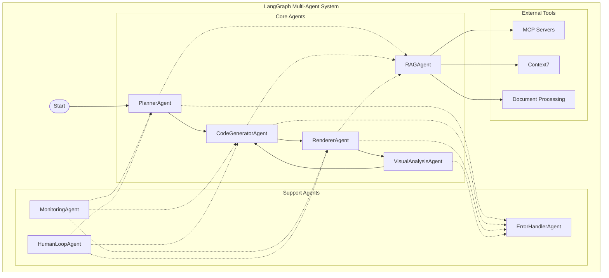
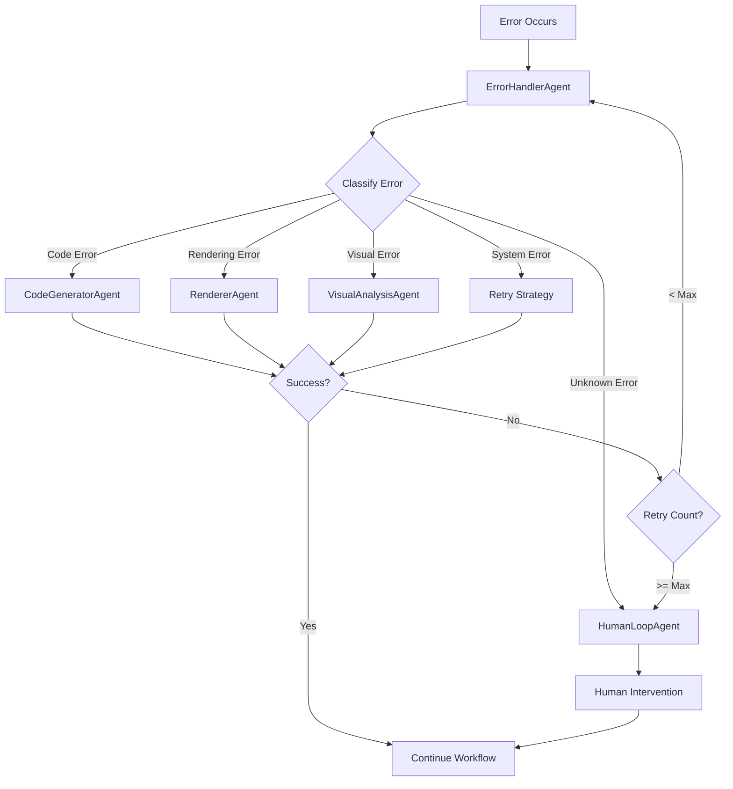

# Design Document

## Overview

This design transforms the existing sequential video generation pipeline (planner → code_generator → video_renderer) into a collaborative multi-agent system using LangGraph. The new architecture will leverage LangGraph's state management, error handling, and agent orchestration capabilities to create a more robust, scalable, and maintainable system.

The system will maintain the same external API while internally restructuring the workflow into specialized agents that can collaborate, handle errors gracefully, and support human-in-the-loop interactions.

## Architecture

### High-Level Architecture



### Agent Specialization

#### 1. PlannerAgent
- **Responsibility**: Video planning and scene outline generation
- **Current Mapping**: `EnhancedVideoPlanner` class
- **Key Functions**:
  - Generate scene outlines
  - Detect required plugins
  - Create implementation plans
  - Handle concurrent scene processing

#### 2. CodeGeneratorAgent  
- **Responsibility**: Manim code generation and error correction
- **Current Mapping**: `CodeGenerator` class
- **Key Functions**:
  - Generate Manim code from scene descriptions
  - Fix code errors using RAG context
  - Handle visual self-reflection
  - Manage code retries and validation

#### 3. RendererAgent
- **Responsibility**: Video rendering and optimization
- **Current Mapping**: `OptimizedVideoRenderer` class  
- **Key Functions**:
  - Render individual scenes
  - Combine videos with audio/subtitles
  - Handle rendering optimizations
  - Manage concurrent rendering

#### 4. VisualAnalysisAgent
- **Responsibility**: Visual error detection and analysis
- **Current Mapping**: Visual analysis methods in `CodeGenerator`
- **Key Functions**:
  - Detect visual errors in rendered videos
  - Provide feedback for code improvements
  - Handle enhanced visual self-reflection

#### 5. RAGAgent
- **Responsibility**: Context retrieval and knowledge management
- **Current Mapping**: RAG functionality across multiple classes
- **Key Functions**:
  - Generate and execute RAG queries
  - Retrieve relevant documentation
  - Manage vector store interactions
  - Handle context caching

#### 6. ErrorHandlerAgent
- **Responsibility**: Centralized error handling and recovery
- **New Component**: Consolidates error handling logic
- **Key Functions**:
  - Route errors to appropriate recovery agents
  - Implement retry strategies
  - Log and track error patterns
  - Escalate to human intervention when needed

#### 7. MonitoringAgent
- **Responsibility**: System observability and performance tracking
- **New Component**: Provides system insights
- **Key Functions**:
  - Track agent performance metrics
  - Monitor resource usage
  - Generate execution reports
  - Provide diagnostic information

#### 8. HumanLoopAgent
- **Responsibility**: Human-in-the-loop interactions
- **New Component**: Manages human intervention points
- **Key Functions**:
  - Present decisions requiring human input
  - Collect and validate human feedback
  - Resume workflows after human intervention
  - Manage approval workflows

## Components and Interfaces

### State Management

```python
from typing import Annotated, List, Optional, Dict, Any
from typing_extensions import TypedDict
from langgraph.graph.message import add_messages

class VideoGenerationState(TypedDict):
    """Central state for the video generation workflow"""
    
    # Core workflow data
    messages: Annotated[List[Any], add_messages]
    topic: str
    description: str
    session_id: str
    
    # Planning state
    scene_outline: Optional[str]
    scene_implementations: Dict[int, str]
    detected_plugins: List[str]
    
    # Code generation state
    generated_code: Dict[int, str]
    code_errors: Dict[int, str]
    rag_context: Dict[str, Any]
    
    # Rendering state
    rendered_videos: Dict[int, str]
    combined_video_path: Optional[str]
    rendering_errors: Dict[int, str]
    
    # Visual analysis state
    visual_analysis_results: Dict[int, Dict[str, Any]]
    visual_errors: Dict[int, List[str]]
    
    # Error handling state
    error_count: int
    retry_count: Dict[str, int]
    escalated_errors: List[Dict[str, Any]]
    
    # Human loop state
    pending_human_input: Optional[Dict[str, Any]]
    human_feedback: Optional[Dict[str, Any]]
    
    # Monitoring state
    performance_metrics: Dict[str, Any]
    execution_trace: List[Dict[str, Any]]
```

### Agent Interfaces

```python
from abc import ABC, abstractmethod
from langgraph.types import Command
from typing import Union, Literal

class BaseAgent(ABC):
    """Base interface for all agents"""
    
    def __init__(self, config: Dict[str, Any]):
        self.config = config
        self.name = self.__class__.__name__
    
    @abstractmethod
    async def execute(self, state: VideoGenerationState) -> Command:
        """Execute the agent's primary function"""
        pass
    
    async def handle_error(self, error: Exception, state: VideoGenerationState) -> Command:
        """Handle errors specific to this agent"""
        return Command(
            goto="error_handler_agent",
            update={"escalated_errors": [{"agent": self.name, "error": str(error)}]}
        )

class PlannerAgent(BaseAgent):
    async def execute(self, state: VideoGenerationState) -> Command[Literal["code_generator_agent", "error_handler_agent"]]:
        # Implementation here
        pass

class CodeGeneratorAgent(BaseAgent):
    async def execute(self, state: VideoGenerationState) -> Command[Literal["renderer_agent", "rag_agent", "error_handler_agent"]]:
        # Implementation here
        pass
```

### Tool Integration

```python
from langgraph.prebuilt import create_react_agent
from langchain_core.tools import tool
from typing import Annotated
from langgraph.prebuilt import InjectedState

# Document Processing Tool Integration
@tool
def docling_document_processor(
    document_path: str,
    state: Annotated[VideoGenerationState, InjectedState]
) -> str:
    """Process documents using Docling"""
    # Use Docling for advanced document parsing and processing
    pass

@tool
def mcp_external_api(
    api_endpoint: str,
    parameters: Dict[str, Any],
    state: Annotated[VideoGenerationState, InjectedState]
) -> str:
    """Access external APIs through MCP servers"""
    # Connect to MCP server for external API access
    pass

@tool  
def context7_query(
    query: str,
    library_id: str,
    state: Annotated[VideoGenerationState, InjectedState]
) -> str:
    """Query Context7 for library documentation"""
    # Connect to Context7 for enhanced documentation
    pass

# Human-in-the-loop tools
@tool
def request_human_approval(
    decision_context: str,
    options: List[str],
    state: Annotated[VideoGenerationState, InjectedState]
) -> Command:
    """Request human input for critical decisions"""
    return Command(
        goto="human_loop_agent",
        update={"pending_human_input": {
            "context": decision_context,
            "options": options,
            "requesting_agent": "current_agent"
        }}
    )
```

## Data Models

### Agent Configuration

```python
@dataclass
class AgentConfig:
    """Configuration for individual agents"""
    name: str
    model_config: Dict[str, Any]
    tools: List[str]
    max_retries: int = 3
    timeout_seconds: int = 300
    enable_human_loop: bool = False
    
@dataclass  
class SystemConfig:
    """Overall system configuration"""
    agents: Dict[str, AgentConfig]
    llm_providers: Dict[str, Dict[str, Any]]  # AWS Bedrock, OpenAI configs
    docling_config: Dict[str, Any]
    mcp_servers: Dict[str, Dict[str, Any]]
    context7_config: Dict[str, Any]
    monitoring_config: Dict[str, Any]
    human_loop_config: Dict[str, Any]
```

### Error Handling Models

```python
@dataclass
class AgentError:
    """Structured error information"""
    agent_name: str
    error_type: str
    error_message: str
    context: Dict[str, Any]
    timestamp: datetime
    retry_count: int
    
@dataclass
class RecoveryStrategy:
    """Error recovery strategy"""
    error_pattern: str
    recovery_agent: str
    max_attempts: int
    escalation_threshold: int
```

## Error Handling

### Error Recovery Workflow



### Error Classification and Recovery

```python
class ErrorHandler:
    """Centralized error handling logic"""
    
    ERROR_PATTERNS = {
        "code_syntax_error": {
            "recovery_agent": "code_generator_agent",
            "max_attempts": 3,
            "use_rag": True
        },
        "rendering_timeout": {
            "recovery_agent": "renderer_agent", 
            "max_attempts": 2,
            "use_alternative_quality": True
        },
        "visual_analysis_failure": {
            "recovery_agent": "visual_analysis_agent",
            "max_attempts": 2,
            "use_fallback_prompt": True
        }
    }
    
    async def handle_error(self, error: AgentError, state: VideoGenerationState) -> Command:
        """Route errors to appropriate recovery strategies"""
        pattern = self.classify_error(error)
        strategy = self.ERROR_PATTERNS.get(pattern)
        
        if not strategy:
            return Command(goto="human_loop_agent")
            
        if error.retry_count >= strategy["max_attempts"]:
            return Command(goto="human_loop_agent")
            
        return Command(
            goto=strategy["recovery_agent"],
            update={"retry_count": {error.agent_name: error.retry_count + 1}}
        )
```

## Testing Strategy

### Unit Testing
- Individual agent testing in isolation
- Mock state and dependencies
- Test error handling paths
- Validate agent interfaces

### Integration Testing  
- Multi-agent workflow testing
- State management validation
- Error propagation testing
- Tool integration testing

### End-to-End Testing
- Complete video generation workflows
- Performance benchmarking
- Human-in-the-loop scenarios
- Failure recovery testing

### Testing Infrastructure

```python
class AgentTestHarness:
    """Testing framework for individual agents"""
    
    def __init__(self, agent_class: Type[BaseAgent]):
        self.agent_class = agent_class
        self.mock_state = self.create_mock_state()
    
    async def test_agent_execution(self, input_state: VideoGenerationState) -> TestResult:
        """Test agent execution with given state"""
        pass
    
    async def test_error_handling(self, error: Exception) -> TestResult:
        """Test agent error handling"""
        pass

class WorkflowTestSuite:
    """End-to-end workflow testing"""
    
    async def test_complete_workflow(self, test_case: Dict[str, Any]) -> TestResult:
        """Test complete video generation workflow"""
        pass
    
    async def test_error_recovery(self, error_scenario: str) -> TestResult:
        """Test error recovery scenarios"""
        pass
```

## Performance Considerations

### Concurrency and Parallelization
- Scene-level parallelization in PlannerAgent
- Concurrent RAG queries in RAGAgent  
- Parallel rendering in RendererAgent
- Asynchronous tool calls across agents

### Resource Management
- Memory-efficient state management
- Connection pooling for external services
- Caching strategies for RAG results
- Resource cleanup and garbage collection

### Monitoring and Optimization
- Agent execution time tracking
- Resource usage monitoring
- Bottleneck identification
- Performance metric collection

## Migration Strategy

### Phase 1: Core Agent Implementation
1. Implement base agent interfaces
2. Create PlannerAgent, CodeGeneratorAgent, RendererAgent
3. Implement basic state management
4. Create simple error handling

### Phase 2: Enhanced Features
1. Add VisualAnalysisAgent and RAGAgent
2. Implement ErrorHandlerAgent and MonitoringAgent
3. Add MCP server integration
4. Implement Context7 connectivity

### Phase 3: Human-in-the-Loop
1. Implement HumanLoopAgent
2. Add approval workflows
3. Create intervention interfaces
4. Add feedback collection

### Phase 4: Optimization and Production
1. Performance optimization
2. Advanced error recovery
3. Comprehensive monitoring
4. Production deployment features

## External Dependencies

### Required Libraries
- `langgraph`: Core orchestration framework
- `langchain`: LLM integration and tools
- `langchain-community`: Additional tools and integrations
- `langchain-aws`: AWS Bedrock integration
- `langchain-openai`: OpenAI integration
- `docling`: Document processing and parsing
- `pydantic`: Data validation and serialization
- `asyncio`: Asynchronous programming support

### External Services
- **LLM Providers**: 
  - AWS Bedrock (Claude, Titan, etc.)
  - OpenAI (GPT-4, GPT-3.5-turbo)
- **Document Processing**: Docling for advanced document parsing
- **MCP Servers**: External APIs and specialized tools
- **Context7**: Enhanced documentation and library support  
- **Vector Stores**: ChromaDB, AstraDB for RAG functionality
- **Monitoring**: LangFuse for observability and tracing

### Configuration Management
- Environment-based configuration
- Agent-specific settings
- Tool and service configurations
- Human-loop interaction settings