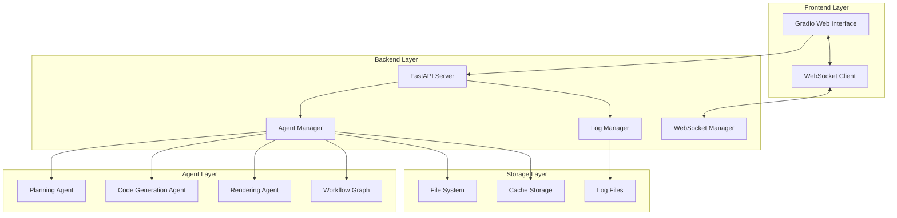

# Design Document

## Overview

The Test UI system provides a comprehensive testing interface for LangGraph agents using a modern web-based architecture. The system consists of a FastAPI backend that manages agent execution and a Gradio frontend that provides an intuitive testing interface. The design enables developers to test individual agents in isolation, execute complete workflows, and monitor real-time execution logs.

## Architecture

### High-Level Architecture



### Component Interaction Flow

1. **User Interaction**: User selects agent and inputs test data through Gradio UI
2. **Request Processing**: FastAPI receives request and validates input
3. **Agent Execution**: Agent Manager executes selected agent or workflow
4. **Real-time Updates**: WebSocket Manager streams logs and progress to frontend
5. **Result Display**: Completed results are displayed in the UI with download options

## Components and Interfaces

### FastAPI Backend Components

#### 1. Main FastAPI Application (`test_backend.py`)
- **Purpose**: Core API server with endpoint definitions
- **Endpoints**:
  - `GET /agents` - List available agents
  - `POST /test/agent/{agent_name}` - Test individual agent
  - `POST /test/workflow` - Test complete workflow
  - `GET /logs/{session_id}` - Retrieve session logs
  - `WebSocket /ws/{session_id}` - Real-time log streaming

#### 2. Agent Manager (`agent_manager.py`)
- **Purpose**: Manages agent lifecycle and execution
- **Key Methods**:
  - `get_available_agents()` - Returns list of testable agents
  - `execute_agent(agent_name, inputs)` - Execute single agent
  - `execute_workflow(inputs)` - Execute complete workflow
  - `get_agent_schema(agent_name)` - Get input schema for agent

#### 3. WebSocket Manager (`websocket_manager.py`)
- **Purpose**: Handles real-time communication with frontend
- **Features**:
  - Session-based log streaming
  - Progress updates
  - Error notifications
  - Connection management

#### 4. Log Manager (`log_manager.py`)
- **Purpose**: Captures and manages execution logs
- **Features**:
  - Structured logging with levels
  - Session-based log separation
  - Real-time log streaming
  - Log persistence and retrieval

### Gradio Frontend Components

#### 1. Main Interface (`test_frontend.py`)
- **Purpose**: Primary user interface for testing
- **Sections**:
  - Agent Selection Panel
  - Input Configuration Panel
  - Execution Control Panel
  - Results Display Panel
  - Log Viewer Panel

#### 2. Agent Test Interface
- **Individual Agent Testing**:
  - Dynamic input forms based on agent schema
  - Step-by-step execution controls
  - Agent-specific result display
- **Workflow Testing**:
  - Complete pipeline execution
  - Progress visualization
  - Video output preview and download

#### 3. Real-time Log Display
- **Features**:
  - Color-coded log levels
  - Auto-scrolling log viewer
  - Log filtering and search
  - Export functionality

## Data Models

### Agent Configuration Schema
```python
class AgentConfig(BaseModel):
    name: str
    description: str
    input_schema: Dict[str, Any]
    output_schema: Dict[str, Any]
    dependencies: List[str]
    test_examples: List[Dict[str, Any]]
```

### Test Request Schema
```python
class TestRequest(BaseModel):
    agent_name: str
    inputs: Dict[str, Any]
    session_id: str
    options: Dict[str, Any] = {}
```

### Test Response Schema
```python
class TestResponse(BaseModel):
    session_id: str
    status: str
    results: Dict[str, Any]
    execution_time: float
    logs: List[LogEntry]
    errors: List[str] = []
```

### Log Entry Schema
```python
class LogEntry(BaseModel):
    timestamp: datetime
    level: str
    message: str
    component: str
    session_id: str
    metadata: Dict[str, Any] = {}
```

## Error Handling

### Backend Error Handling
- **Input Validation**: Pydantic models for request validation
- **Agent Execution Errors**: Graceful error capture and reporting
- **WebSocket Errors**: Connection recovery and error notification
- **Logging Errors**: Fallback logging mechanisms

### Frontend Error Handling
- **Connection Errors**: Automatic reconnection for WebSocket
- **Input Validation**: Client-side validation with clear error messages
- **Display Errors**: Graceful degradation for missing components
- **User Feedback**: Clear error messages and recovery suggestions

## Testing Strategy

### Unit Testing
- **Backend Components**: FastAPI endpoints, Agent Manager, Log Manager
- **Agent Integration**: Individual agent execution tests
- **WebSocket Communication**: Connection and message handling tests
- **Data Models**: Schema validation and serialization tests

### Integration Testing
- **End-to-End Workflows**: Complete workflow execution tests
- **Real-time Communication**: WebSocket streaming tests
- **File Operations**: Output file generation and retrieval tests
- **Error Scenarios**: Failure handling and recovery tests

### Performance Testing
- **Concurrent Execution**: Multiple simultaneous agent tests
- **Memory Usage**: Long-running session memory management
- **WebSocket Performance**: Real-time streaming under load
- **Agent Execution Time**: Performance benchmarking

## Security Considerations

### Input Validation
- **Schema Validation**: Strict input validation using Pydantic
- **Code Injection Prevention**: Sanitization of user inputs
- **File Path Validation**: Secure file operations and path traversal prevention

### Access Control
- **Session Management**: Secure session handling
- **Resource Limits**: Execution time and resource limits
- **File Access**: Restricted file system access

### Data Protection
- **Log Sanitization**: Removal of sensitive data from logs
- **Temporary File Cleanup**: Automatic cleanup of test artifacts
- **Error Message Sanitization**: Safe error message display

## Performance Optimization

### Backend Optimization
- **Async Operations**: Asynchronous agent execution
- **Connection Pooling**: Efficient database and resource connections
- **Caching**: Result caching for repeated operations
- **Resource Management**: Proper cleanup of resources

### Frontend Optimization
- **Lazy Loading**: On-demand component loading
- **Efficient Updates**: Optimized real-time updates
- **Memory Management**: Proper cleanup of UI components
- **Responsive Design**: Efficient rendering for different screen sizes

## Deployment Configuration

### Development Setup
- **Local Development**: Docker Compose for easy setup
- **Hot Reload**: Automatic code reloading for development
- **Debug Mode**: Enhanced logging and error reporting
- **Test Data**: Sample test configurations and data

### Production Setup
- **Container Deployment**: Docker containers for backend and frontend
- **Load Balancing**: Support for multiple backend instances
- **Monitoring**: Health checks and performance monitoring
- **Logging**: Centralized logging configuration

## Configuration Management

### Environment Variables
```bash
# Backend Configuration
FASTAPI_HOST=0.0.0.0
FASTAPI_PORT=8000
LOG_LEVEL=INFO
MAX_CONCURRENT_TESTS=5

# Agent Configuration
AGENT_CONFIG_PATH=./config/agents.json
OUTPUT_DIR=./test_output
CACHE_DIR=./cache

# Frontend Configuration
GRADIO_HOST=0.0.0.0
GRADIO_PORT=7860
BACKEND_URL=http://localhost:8000
```

### Agent Configuration File
```json
{
  "agents": {
    "planning_agent": {
      "name": "Planning Agent",
      "description": "Generates scene outlines and implementations",
      "input_schema": {
        "topic": {"type": "string", "required": true},
        "description": {"type": "string", "required": true}
      },
      "test_examples": [
        {
          "topic": "Fourier Transform",
          "description": "Explain the mathematical concept of Fourier Transform"
        }
      ]
    }
  }
}
```

## Monitoring and Observability

### Metrics Collection
- **Execution Metrics**: Agent execution times and success rates
- **System Metrics**: CPU, memory, and disk usage
- **User Metrics**: Test frequency and patterns
- **Error Metrics**: Error rates and types

### Logging Strategy
- **Structured Logging**: JSON-formatted logs with consistent fields
- **Log Levels**: Appropriate use of DEBUG, INFO, WARN, ERROR levels
- **Log Aggregation**: Centralized log collection and analysis
- **Log Retention**: Configurable log retention policies

### Health Monitoring
- **Health Endpoints**: API health check endpoints
- **Service Dependencies**: Monitoring of external dependencies
- **Resource Monitoring**: System resource usage tracking
- **Alert Configuration**: Automated alerts for critical issues